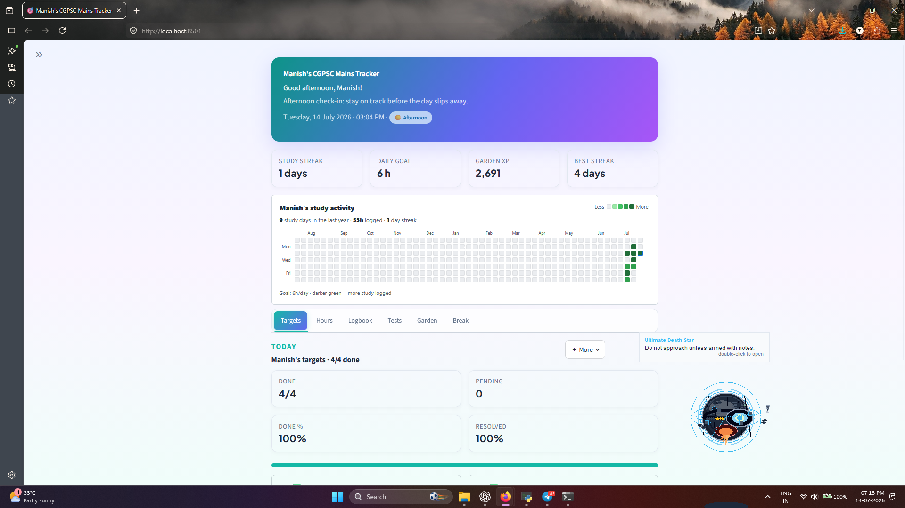
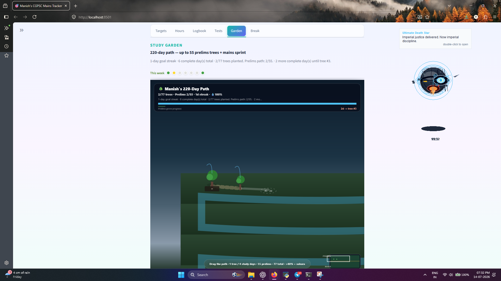

# Study Routine Tracker for CGPSC Aspirants

### Build unbreakable habits. Show up daily. Grow your Study Garden.

A gamified, **local-first** study planner for CGPSC and any competitive exam or academic goal. Set daily targets, log hours, keep a subject logbook, grow your garden with XP, and protect your streak with a GitHub-style heatmap — no account required.

[](https://www.python.org/)
[](https://streamlit.io/)
[](LICENSE)
[](https://github.com/mnis846/study-routine-tracker)

<p align="center">
  
</p>

<p align="center">
  <a href="#-one-click-setup"><strong>One-click setup</strong></a> ·
  <a href="#-features-free-vs-pro"><strong>Free vs Pro</strong></a> ·
  <a href="#-live-demo"><strong>Live demo</strong></a> ·
  <a href="#-license"><strong>MIT License</strong></a>
</p>

---

## Why this exists

Most aspirants fail from **inconsistency**, not lack of resources. This app turns daily study into a visible habit loop:

**Plan → Log → Grow → Show up again tomorrow.**

Built for personal use, demos, and pitching a productized exam-prep toolkit.

---

## Screenshots

Hero banner is included above. **App screenshots** (dashboard, garden, heatmap) go here after you capture them once locally.

**How to add them (2 minutes):**

1. Run the app (`Start Tracker.bat` or `streamlit run app.py`).
2. Capture 3 windows (or record a short GIF of break games).
3. Save into `docs/screenshots/` using the names below, then wire them into this section:

```text
docs/screenshots/
  hero.jpg          # included
  dashboard.png     # daily targets + hours
  garden.png        # Study Garden XP path
  heatmap.png       # GitHub-style consistency grid
  break-games.gif   # optional mini-games GIF
```

Example markdown once files exist:

```markdown
| Dashboard | Garden | Heatmap |
| --- | --- | --- |
|  |  |  |
```

---

## Live demo

> **Deploy once, paste the URL below.** Until then, run locally in under a minute.

| Status | Link |
| --- | --- |
| **Live demo** | _Coming soon_ — Streamlit Community Cloud recommended |
| **Source** | https://github.com/mnis846/study-routine-tracker |

### Deploy on Streamlit Community Cloud (free)

1. Open [share.streamlit.io](https://share.streamlit.io/) and connect this GitHub repo.
2. Set **Main file path** to `app.py`.
3. Deploy → copy the public URL (e.g. `https://YOUR-APP.streamlit.app`).
4. Paste that URL into the **Live demo** row above (and optionally set GitHub repo **Homepage**).

Optional secrets for Pro unlock codes: see `.streamlit/secrets.toml.example` (or app Settings).

> **Note:** Cloud storage is ephemeral between sleep/redeploy. For lasting history, run locally or export backups from the app (Pro).

---

## One-click setup

### Windows (recommended)

1. **Clone** (or download ZIP and extract):

   ```bash
   git clone https://github.com/mnis846/study-routine-tracker.git
   cd study-routine-tracker
   ```

2. **One-time install** (Python 3.10+ required):

   ```bash
   python -m venv venv
   venv\Scripts\activate
   pip install -r requirements.txt
   ```

3. **Launch** — double-click:

   | File | What it does |
   | --- | --- |
   | **`Start Tracker.bat`** | Starts the web app (+ optional desktop study coach) |
   | **`Tracker Control.bat`** | Start / stop / status helpers |
   | **`Stop Sticker.bat`** | Stops the desktop companion only |

Browser opens at the URL Streamlit prints (usually **http://localhost:8501**). **No signup.**

### Cross-platform (any OS)

```bash
git clone https://github.com/mnis846/study-routine-tracker.git
cd study-routine-tracker

python -m venv venv
# Windows:  venv\Scripts\activate
# macOS/Linux:
source venv/bin/activate

pip install -r requirements.txt
streamlit run app.py
```

### Optional: desktop study coach (Windows)

```bash
python desktop_companion.py
```

---

## Features (Free vs Pro)

### Free forever

| Feature | Details |
| --- | --- |
| **Daily targets** | Plan morning goals; check off or skip; evening reflection (up to **3** targets/day) |
| **Hours tracking** | Quick logs, daily goal, weekly charts, study streak |
| **Logbook** | Subject + activity journal |
| **Study Garden** | XP growth through early stages (capped for free users) |
| **Show-up heatmap** | GitHub-style consistency grid |
| **Break games** | Short reset mini-games between sessions |
| **Local-first data** | Single local profile · SQLite on device · no forced login |

### Pro (one-time unlock)

| Feature | Details |
| --- | --- |
| **Unlimited daily targets** | No 3-target cap |
| **Full garden path** | All evolution stages (foundation path → exam sprint) |
| **CSV export** | Download hours, targets, and logbook |
| **Extended analytics** | Longest streak and richer history views |
| **Study coach sticker** | Desktop companion characters (Windows) |

Unlock flow: pay (Razorpay link when configured) → enter unlock code in **Settings**. Default list price in config: **₹499** one-time.

### Future / roadmap ideas

- Spaced-revision reminders  
- Multi-device sync / export polish  
- Optional accounts when multi-user is needed  
- AI weekly review (local or API)  
- Academy tier (coaching batch features)

---

## Data storage

| Environment | Database location |
| --- | --- |
| Desktop (default) | `study_routine_tracker.db` next to the app |
| Custom path | Set env `TRACKER_DATA_DIR` |
| Streamlit Cloud | `~/.study_routine_tracker/study_routine_tracker.db` |

The sidebar shows the active database path.

---

## Tech stack

- **Python + Streamlit** — UI  
- **SQLite** — local persistence  
- **Pandas + Plotly** — analytics  

---

## Project layout (high level)

```
app.py                 # Streamlit entry (thin)
tracker/               # App package (UI, database, garden, …)
assets/ · games/       # Stickers, CSS, break games
docs/                  # Screenshots + STRUCTURE.md
tests/                 # Persistence smoke tests
scripts/ · launchers/  # Windows helpers
```

Full tree: [docs/STRUCTURE.md](docs/STRUCTURE.md)

---

## License

This project is licensed under the **[MIT License](LICENSE)** — free to use, modify, and share.

Built by aspirants, for aspirants. **Show up daily.**

**GitHub:** https://github.com/mnis846/study-routine-tracker
