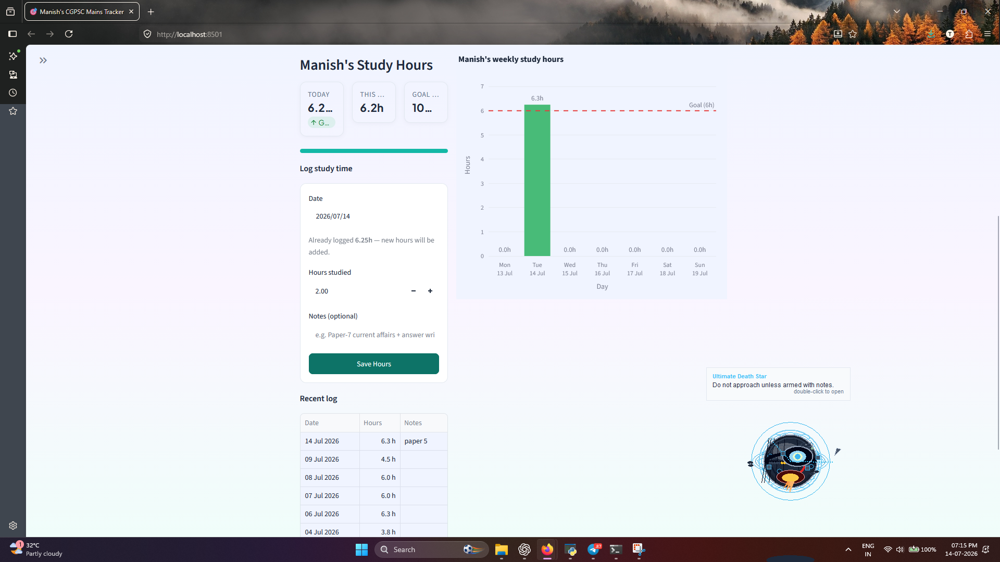
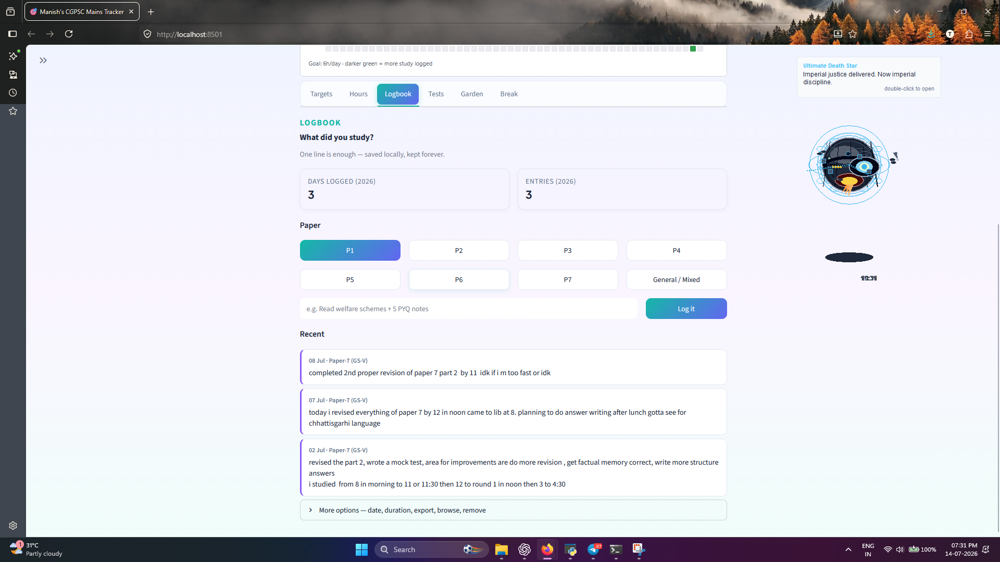
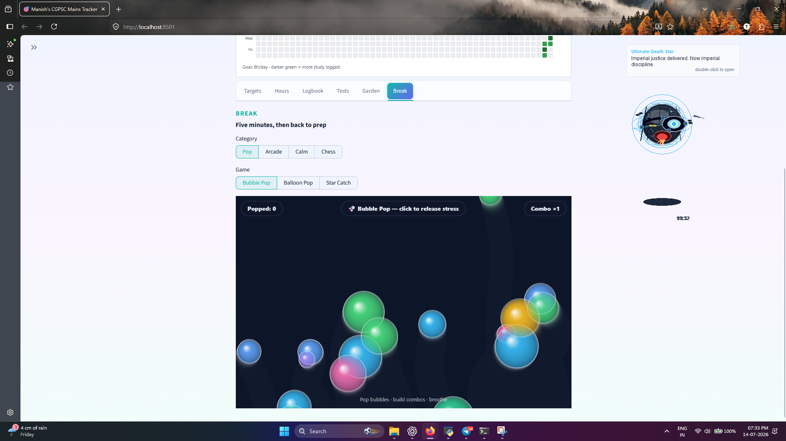

# Study Routine Tracker for CGPSC Aspirants

### Build unbreakable habits. Show up daily. Grow your Study Garden.

A gamified **Streamlit** study planner for CGPSC and any competitive exam or academic goal.  
Set daily targets, log hours, keep a subject logbook, grow your garden with XP, and protect your streak with a GitHub-style heatmap — **no account required**.

> **Recommended for most users:** the **Streamlit app** (`streamlit run app.py` / `Start Tracker.bat`).  
> Runs in your browser, saves progress on your PC, and is the easiest way to keep streaks & garden growth continuous.

[](https://www.python.org/)
[](https://streamlit.io/)
[](LICENSE)
[](https://github.com/mnis846/study-routine-tracker)

<p align="center">
  
</p>

<p align="center">
  <a href="#streamlit-app-for-most-users"><strong>Start with Streamlit</strong></a> ·
  <a href="#-live-demo"><strong>Live demo</strong></a> ·
  <a href="#one-click-setup-local-streamlit"><strong>Local setup</strong></a> ·
  <a href="#-license"><strong>MIT License</strong></a>
</p>

---

## Why this exists

Most aspirants fail from **inconsistency**, not lack of resources. This app turns daily study into a visible habit loop:

**Plan → Log → Grow → Show up again tomorrow.**

Built for personal use, demos, and sharing with fellow aspirants.

---

## Screenshots

| Targets | Hours | Logbook |
| --- | --- | --- |
|  |  |  |

| Garden | Break |
| --- | --- |
|  |  |

---

## Streamlit app (for most users)

This project’s **main product is the Streamlit web app**. One browser window, full features, local saves.

| How you run it | Best for | Streaks / garden / logbook |
| --- | --- | --- |
| **On your PC** (`streamlit run app.py` or `Start Tracker.bat`) | Daily habit tracking | **Yes — saved in a local SQLite file** and continues after restart |
| **Streamlit Community Cloud** (public demo URL) | Sharing / try-before-install | Temporary — can reset when the app sleeps or redeploys |

**For continuous streaks and garden XP, run Streamlit on your own computer.**  
Sidebar shows *Saving works on this device* and offers **Download full backup (.db)**.

---

## Live demo

| Status | Link |
| --- | --- |
| **Live demo** | _Deploy once on Streamlit Cloud, then paste the URL here_ |
| **Source** | https://github.com/mnis846/study-routine-tracker |

### Deploy on Streamlit Community Cloud (free try-out)

1. Open [share.streamlit.io](https://share.streamlit.io/) → sign in with GitHub.
2. **New app** → this repo → branch **`main`**.
3. **Main file path:** `app.py` · Python version 3.11+ if asked.
4. Deploy → share the `*.streamlit.app` link with friends.

Optional secrets (Pro codes): `.streamlit/secrets.toml.example` → Cloud **Secrets**.

> Cloud is great for demos. For **your** multi-month prep streak, use the local Streamlit install below.

---

## One-click setup (local Streamlit)

### Windows (easiest)

1. **Clone** (or download ZIP and extract):

   ```bash
   git clone https://github.com/mnis846/study-routine-tracker.git
   cd study-routine-tracker
   ```

2. **One-time install** (Python 3.10+ required):

   ```bash
   python -m venv venv
   venv\Scripts\activate
   pip install -r requirements.txt
   ```

3. **Launch Streamlit** — double-click:

   | File | What it does |
   | --- | --- |
   | **`Start Tracker.bat`** | Starts Streamlit (+ optional desktop study coach) |
   | **`Tracker Control.bat`** | Start / stop / status helpers |
   | **`Stop Sticker.bat`** | Stops the desktop companion only |

Browser opens at **http://localhost:8501**. **No signup.** Progress saves automatically.

Or from the activated venv:

```bash
streamlit run app.py
```

### Optional: desktop study coach (Windows only)

```bash
python desktop_companion.py
```

Pairs with the Streamlit app for quick hour logs from the tray sticker.

---

## Data storage (continuity)

| Environment | Database location | Keeps long streaks? |
| --- | --- | --- |
| **Local Streamlit (recommended)** | `study_routine_tracker.db` in the project folder | **Yes** — same folder every day |
| Custom path | Env `TRACKER_DATA_DIR` | Yes, if you keep that folder |
| Streamlit Cloud | Under the host home dir | **No guarantee** after sleep/redeploy |

The sidebar shows the active database path and a free **full backup** download.

---

## Tech stack

- **Streamlit** — main app (browser UI)  
- **SQLite** — local persistence  
- **Pandas + Plotly** — analytics  

---

## Project layout (high level)

```
app.py                 # Streamlit entry (thin)
tracker/               # App package (UI, database, garden, …)
assets/ · games/       # Stickers, CSS, break games
docs/                  # Screenshots + STRUCTURE.md
tests/                 # Persistence smoke tests
scripts/ · launchers/  # Windows helpers
```

Full tree: [docs/STRUCTURE.md](docs/STRUCTURE.md)

---

## License

This project is licensed under the **[MIT License](LICENSE)** — free to use, modify, and share.

Built by aspirants, for aspirants. **Show up daily.**

**GitHub:** https://github.com/mnis846/study-routine-tracker
